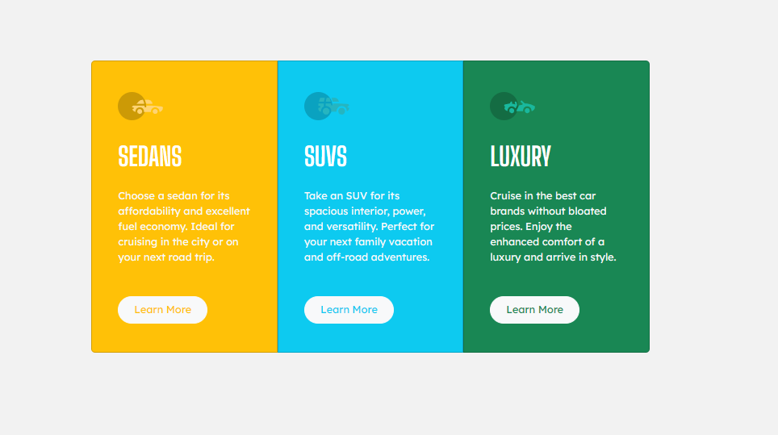

# Frontend Mentor - 3-column preview card component solution

This is a solution to the [3-column preview card component challenge on Frontend Mentor](https://www.frontendmentor.io/challenges/3column-preview-card-component-pH92eAR2-). Frontend Mentor challenges help you improve your coding skills by building realistic projects. 

## Table of contents

- [Overview](#overview)
  - [The challenge](#the-challenge)
  - [Screenshot](#screenshot)
  - [Links](#links)
- [My process](#my-process)
  - [Built with](#built-with)
  - [What I learned](#what-i-learned)
- [Author](#author)

## Overview

### The challenge

Users should be able to:

- View the optimal layout depending on their device's screen size
- See hover states for interactive elements

### Screenshot

 

### Links

- Solution URL: [HTML](https://github.com/ZahidurRahman8759/3-Column-Preview-Card-Component-Main/blob/3a173059d454902b2e4956666d32ccef3fb8b531/index.html)
- Solution URL: [CSS](https://github.com/ZahidurRahman8759/3-Column-Preview-Card-Component-Main/blob/3a173059d454902b2e4956666d32ccef3fb8b531/style.css)
- Live Site URL: [LIVE SITE](https://zahidurrahman8759.github.io/3-Column-Preview-Card-Component-Main/)

## My process

### Built with

- Semantic HTML5 markup
- CSS custom properties
- Flexbox
- Mobile-first workflow
- [Bootstrap] (https://getbootstrap.com/) - Bootstrap5

### What I learned

I built this project with the help of Bootstrap 5. It was easier by not using Bootstrap but I wanted a go and try it out. It was fun and learned a lot about customization of the default bootstrap codes.

## Author

- Frontend Mentor - [@ZahidurRahman8759](https://www.frontendmentor.io/profile/ZahidurRahman8759)
